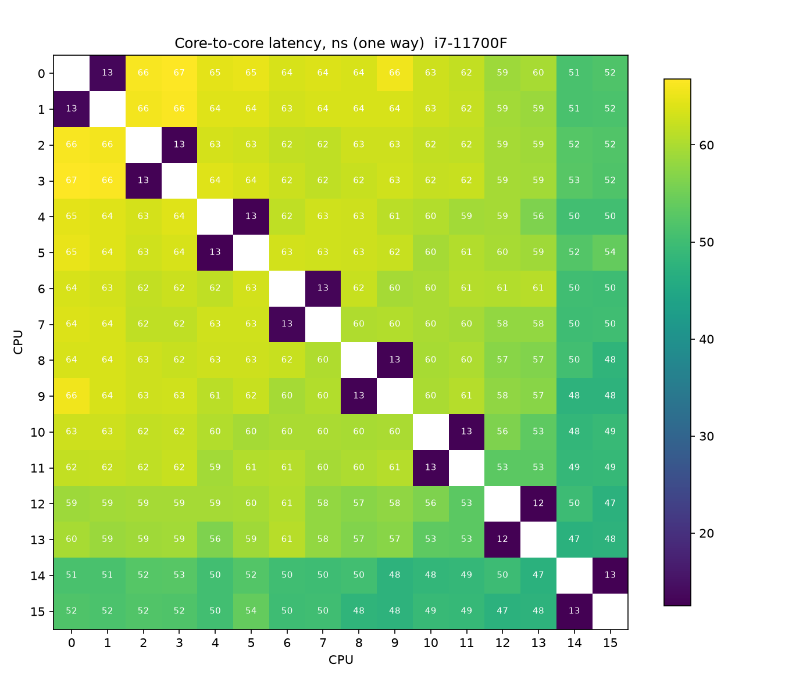
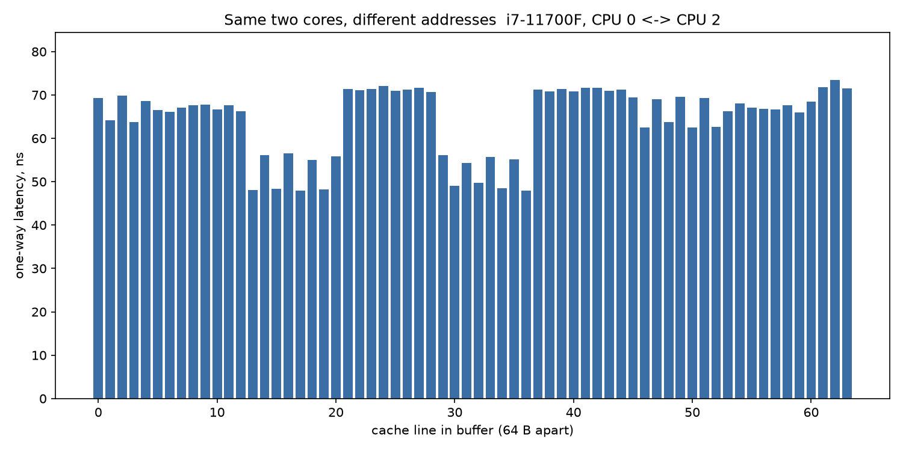

# Core-to-core latency

Two threads pinned to two CPUs pass a counter back and forth through one
cache line. Each hop moves the line from one core's cache to the other's,
so half of a round trip is the one-way latency.

`core_latency.cpp` measures every pair of logical CPUs:



Hyperthreads on the same physical core (0-1, 2-3, ...) do it in about
13 ns because they share L1. Different physical cores take 47-67 ns.

When I ran it twice, the pattern changed: in one run cores 8-9 were the
"closest" to everyone, in the other it was 14-15. My understanding is that
this comes from the L3 layout. The L3 is split into slices on a ring, and
each address is hashed to one slice. A line moving between two cores goes
through its home slice, so the latency depends on where that slice is.
The line lives on the stack, and Windows puts the stack at a new address
on every run.

`address_latency.cpp` checks this directly: one fixed pair of cores, 64
neighbouring cache lines in one buffer.



CPU 0 and CPU 2 take anywhere from 48 to 73 ns depending on the line.
Intel doesn't document the slice hash, so I'm not trying to explain the
exact pattern.

## Setup

i7-11700F (8C/16T, turbo on), Windows, g++ 13.1 -O2, 100k round trips per
measurement, median of 5.

The spin loops don't use `_mm_pause()`. On this CPU generation pause takes
around 140 cycles and would swamp the measurement.

## Build

```
g++ -std=c++20 -O2 -pthread core_latency.cpp -o core_latency
./core_latency
python plot.py "i7-11700F"

g++ -std=c++20 -O2 -pthread address_latency.cpp -o address_latency
./address_latency 0 2
python plot_address.py "i7-11700F, CPU 0 <-> CPU 2"
```

Plots need `pip install matplotlib`. Close the browser and other heavy
stuff before running. A background task on one core shows up as a
1000 ns cell in the heatmap.

Post: [LinkedIn](https://lnkd.in/p/dcQpYK69)
